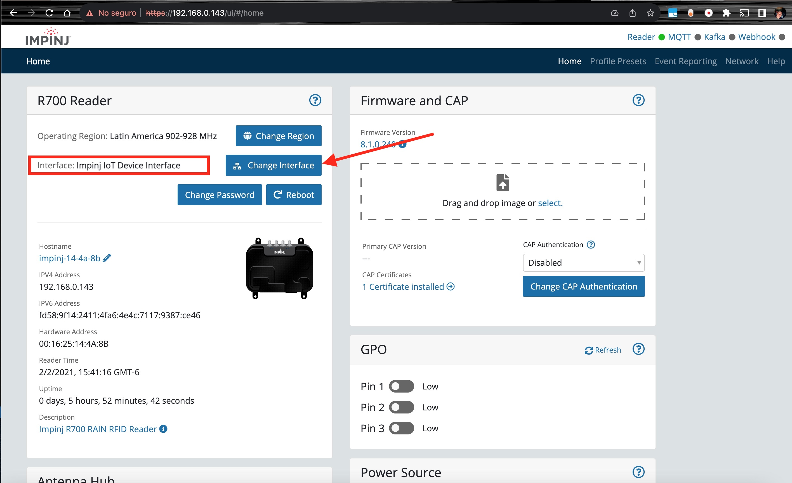
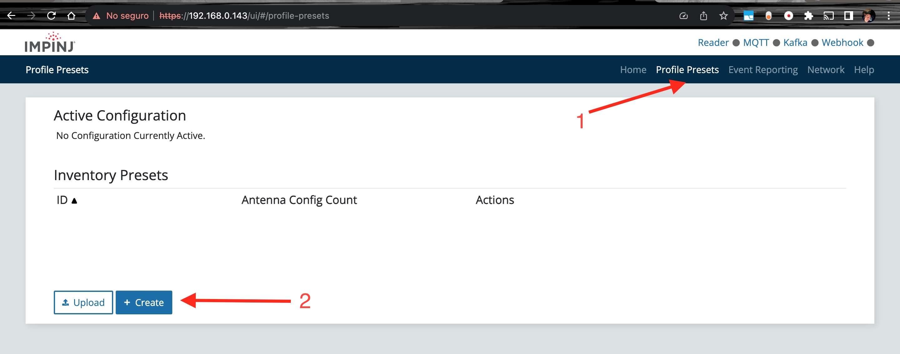
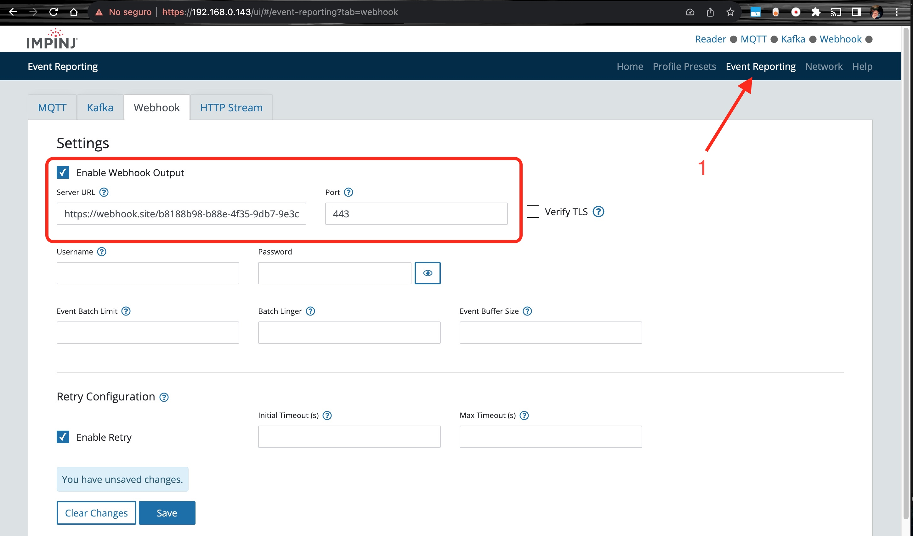
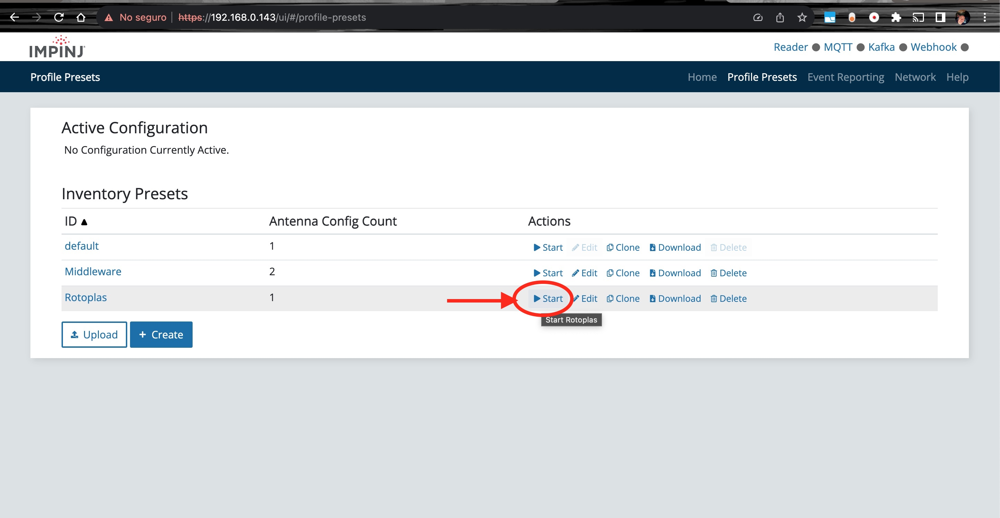

#Instructivo obtencion de datos Lector Impinj R700

## 1. Conectar el lector a la red

Para poder acceder al lector es necesario que este conectado a la red, para esto se debe conectar el cable de red al lector y a un switch o router.

## 2. Obtener la IP del lector

Para obtener la IP del lector se debe conectar hacer ping a ping impinj-XX-XX-XX.local, el lector obtiene la IP del servidor DHCP, por lo que es necesario que el servidor DHCP este activo.

## 3. Acceder al lector

Para acceder al lector se debe ingresar a la IP del lector en un navegador, se debe ingresar el usuario y contraseña, por defecto es:

```
usuario: root
contraseña: impinj
```

## 4. Configurar el lector

Se debe cambiar la interface a Impinj IoT device como se muestra en la imagen:



## 5. Configurar el perfil de lectura

Se debe configurar el perfil de lectura como se muestra en la imagen:



## 6. Configurar el lectura

Como se muestra en el PDF: [profile](profile.pdf)   

## 7. Configurar el reporte http

Se debe configurar el reporte http como se muestra en la imagen: 

Este reporte genera un post al servidor configurado en este punto. 
Incluso si no existen tags llegara un arreglo vacio cada segundo con el fin de mantener la conexion activa.
Si se desea detener esto se debe detener este servicio de webhook.


## 8. Iniciar el servicio de lectura
Activando el perfil como se muestra en la imagen. 

Esta es la forma manual, posteriormente se describe el metodo programatico, con una llamada http.


## 9. Obtener los datos

Los datos deben estar llegando al servidor


# Método de incio de lectura prográmatico

Se anexan 2 collecciones de postman, la llamada ```Impinj Reader Rotoplas.postman_collection.json``` unicamente incluye los metodos extrictamente necesarios para iniciar y detener la lectura y transmision de datos.

La collecion  ```Impinj Reader Configuration REST API.postman_collection``` incluye todos los metodos disponibles para el lector.

la ruta ```http://lector/api/v1/openapi.json``` es la ruta para obtener la documentacion de la api del lector, si usan algun producto automatizado para generar el cliente de la api, esta es la ruta que deben usar.

El lector requiere authenticacion basica, el usuario y contraseña son los mismos que se usan para acceder al lector por medio del navegador.

un ejemplo de una petición get es: 
````
curl --location 'http://Lector/api/v1/status' \
--header 'Accept: application/json' \
--header 'Authorization: Basic cm9vdDppbXBpbmo='
````

Es posible usar HTTPS, pero se deben configurar los certificados SSL.

En el siguente video se muestra como usar la collecion de postman para iniciar y detener el servicio.

Este es un ejemplo de como llegan los datos. Es un arreglo de objetos json donde cada objeto es una etiqueta leida. 

````
[
  {
    "timestamp": "2021-02-02T22:18:35.658476625Z",
    "eventType": "tagInventory",
    "tagInventoryEvent": {
      "epc": "4oARYGAAAgpmgfI_",
      "epcHex": "E28011606000020A6681F23F",
      "antennaPort": 1,
      "antennaName": "Portal1",
      "lastSeenTime": "2021-02-02T22:18:35.499734Z"
    }
  },
  {
    "timestamp": "2021-02-02T22:18:35.908535Z",
    "eventType": "tagInventory",
    "tagInventoryEvent": {
      "epc": "4oARYGAAAgpmhG1A",
      "epcHex": "E28011606000020A66846D40",
      "antennaPort": 1,
      "antennaName": "Portal1",
      "lastSeenTime": "2021-02-02T22:18:35.858088Z"
    }
  },
  {
    "timestamp": "2021-02-02T22:18:35.908760625Z",
    "eventType": "tagInventory",
    "tagInventoryEvent": {
      "epc": "MTYwMjAwMDEgICAg",
      "epcHex": "313630323030303120202020",
      "antennaPort": 1,
      "antennaName": "Portal1",
      "lastSeenTime": "2021-02-02T22:18:35.887319Z"
    }
  }
]
````

